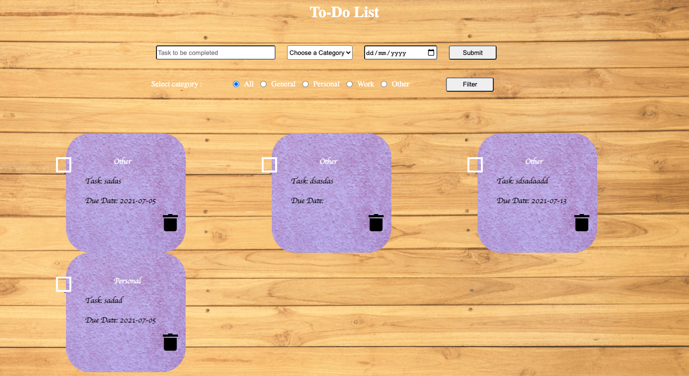

## ToDo List App

>ToDoList is a software in the category of Task Management “Getting Things Done”, Scheduling, and Collaboration. We have a lot of choices to help us keep track of daily obligations. A simple list on paper of things “To Do” is enough for some people.

---


## Technologies Used

|Technology| Version|
|----------|--------|
|express|4.17.1|
|express-ejs-layouts|2.5.0|
|express-session|1.17.1|
|cookie-parser|1.4.5|
|connect-flash|0.1.1|
|mongoose|5.9.26|
|node-sass-middleware|0.11.0|
|ejs|3.1.3|

---

## Functionality
* Add task
* <p> You can mark a task as completed, and delete the task from the list.</p>
* Filter Task

---

## Installation

### Clone The Repository

```
git clone https://github.com/DeepakUp9/todo_list.git
```
### Into The Project Directory
```
cd todo_list
```
### Installing NPM dependencies
```
npm install
```

## To run:
   1. Run command "mongod" on terminal to start connection with MongoDB.
   2. On separate terminal run "nodemon index.js" or "node index.js" to start the server.
   3. The application works on port 8000, so open "http://localhost:8000/index" to get to home page.
   4. To close server press ctrl+c.


## Folder Structure

* assets
    * css 
        * header.css
        * home.css
        * layout.css
    * js
        * layout.js
    * scss 
        * header.css
        * home.css
        * layout.css
    * images 
        * Screenshot.png
* config
    * middleware.js
    * mongoose.js
* controllers
    * home_controllers.js
    * user_controllers.js
* models
    * user.js
* routes
    * index.js
    * users.js
* views 
    * _header.ejs
    * _toDo.ejs
    * home.ejs
    * layout.ejs
* .gitignore
* index.js
* package.json
* package-lock.json
* README.md


        


